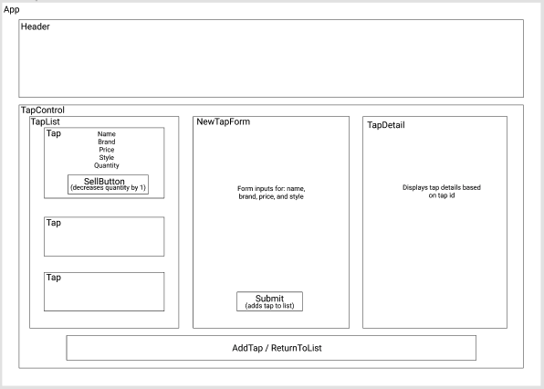
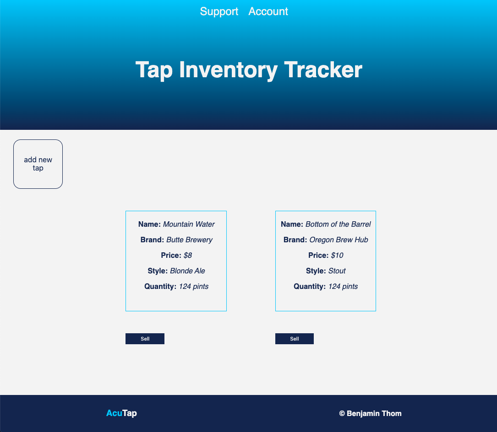

# Tap Inventory Tracker

### A website for tracking inventory for a taproom. May 1st, 2020
#### By: Benjamin Thom

## Description

_A React website that monitors, updates, and manages the shared state of a taproom's inventory utilizing Redux. Inventory is organized by name, brand, price, style, quantity, and id. The application includes a tap list, a new tap form, and tap-specific details view to accurately monitor inventory._

## Component Tree

## Web Page Preview

## Specification User Stories
* A user should be able to create, read, and update taps in the taproom.
* A user should be able to sell a pint from a tap listed on the tap list, which reduces tap quantity by 1.
* When the quantity of a tap is 0, the tap should say "out of stock". A user should not be able to reduce the quantity of a tap below 0.

## Setup/Installation Requirements

#### Node install

###### For macOS:
_If Homebrew is not installed on your computer already, then install Homebrew by entering the following two commands in Terminal:_
* $ /usr/bin/ruby -e "$(curl -fsSL https://raw.githubusercontent.com/Homebrew/install/master/install)"
* $ echo 'export PATH=/usr/local/bin:$PATH' >> ~/.bash_profile

_Install Git with the following command:_
* $ brew install git

_Next, install Node.js by entering the following command in Terminal:_
* $ brew install node

###### For Windows:
_Please visit the [Node.js website](https://nodejs.org/en/download/) for installation instructions._

#### Install this application

_Clone this repository via Terminal using the following commands:_
* _$ cd desktop_
* _$ git clone {https://github.com/benjamin-thompdx/tap-room-redux}_
* _$ cd tap-room-redux_
_Then, confirm that you have navigated to the tap-room-redux project directory by entering "pwd" in Terminal._

_Next, install npm at the project's root directory via the following commands:_
* _$ npm install_
* _$ npm install redux@4.0.5 react-redux@7.1.3_
* _$ npm run build_

_Open the contents of the directory in a text editor or IDE of your choice (e.g., to open the contents of the directory in Visual Studio Code on macOS, enter the command "code ." in Terminal)._

## Known Bugs

_No known bugs at this time._

## Support and Contact Details

_Have a bug or an issue with this application? [Open a new issue](https://github.com/benjamin-thompdx/tap-room-redux/issues) here on GitHub._

## Technologies Used

* Git
* JavaScript
* npm
* Webpack
* Jest
* React
* Redux

### License

[MIT](https://choosealicense.com/licenses/mit/)

Copyright (c) 2020 **_Benjamin Thom_** 
